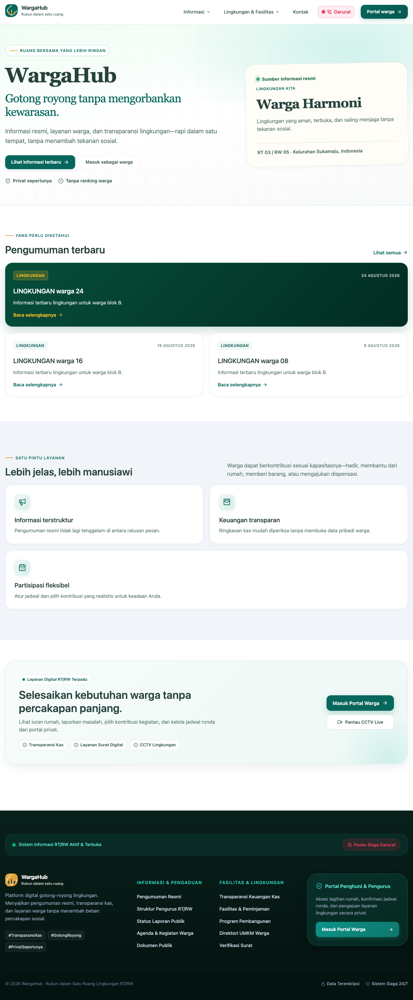

<div align="center">

# WargaHub

### Rukun dalam satu ruang

Platform open-source untuk membantu lingkungan RT/RW menyampaikan informasi, mengelola layanan warga, dan menjaga transparansi dengan tetap menghormati privasi.

[](https://github.com/RiprLutuk/WargaHub/releases)
[](LICENSE)
[](https://bun.sh)
[](https://vuejs.org)
[](https://fastify.dev)

<br />



<br />

[Demo](#demo) · [Fitur](#fitur-utama) · [Lokal](#menjalankan-secara-lokal) · [Deployment](#deployment) · [Kontribusi](#kontribusi)

</div>

## Tentang proyek

WargaHub memisahkan informasi publik dari data privat warga. Portal publik menyediakan pengumuman, agenda, dokumen, struktur pengurus, fasilitas, CCTV, program lingkungan, UMKM, dan laporan transparansi. Portal privat menyediakan iuran, surat digital, pengaduan, kegiatan, ronda, voting, dan peminjaman fasilitas.

Proyek ini dirancang untuk dapat dipakai ulang oleh lingkungan lain: kontrak API tervalidasi, komponen UI reusable, URL tab yang share-friendly, PWA installable, dan route frontend yang lazy-loaded.

## Demo

- **Portal publik:** [wargahub.demo.pandanteknik.com](https://wargahub.demo.pandanteknik.com)
- **Alias Vercel:** [wargahub.vercel.app](https://wargahub.vercel.app)
- **API health:** [api.wargahub.pandanteknik.com/health](https://api.wargahub.pandanteknik.com/health)

Seed demo berisi 100+ warga/rumah, pengumuman, laporan, agenda, dokumen, fasilitas, program, UMKM, tagihan, dan ratusan transaksi kas. Gunakan data demo hanya untuk eksplorasi.

## Fitur utama

| Area | Yang tersedia |
| --- | --- |
| **Informasi publik** | Pengumuman, agenda, dokumen, struktur RT/RW, kontak, darurat, CCTV, program, UMKM, dan transparansi kas. |
| **Data warga** | Rumah, warga, undangan verifikasi, import/export CSV, status hunian, dan RBAC. |
| **Keuangan** | Iuran, verifikasi bukti transfer, ledger append-only, reversal transaksi, dan laporan agregat publik. |
| **Layanan digital** | Surat pengantar, pengaduan privat, kegiatan, ronda, voting, dan peminjaman fasilitas. |
| **Operasional** | PIC, histori status, soft delete, audit log, notifikasi, dan broadcast WhatsApp opsional. |

## Teknologi

- **Frontend:** Vue 3, Vite, Vue Router, Pinia, PWA
- **Backend:** Fastify 5, Zod contracts, OpenAPI
- **Database:** PGlite untuk lokal, PostgreSQL untuk production
- **Runtime:** Bun workspace monorepo
- **Deployment:** Vercel untuk web, container host untuk API
- **Analytics:** Vercel Web Analytics

## Struktur repository

```text
WargaHub/
├── apps/web       # portal publik dan portal warga
├── apps/api       # REST API, auth, worker, dan database
├── packages/*     # kontrak dan utilitas lintas aplikasi
├── docs/          # arsitektur, deployment, backup, dan aset preview
└── PRD-WargaHub.md
```

## Menjalankan secara lokal

### Prasyarat

- Bun `1.3.12` atau lebih baru
- Node.js `22`–`24` bila dibutuhkan oleh tooling

### Instalasi

```bash
git clone https://github.com/RiprLutuk/WargaHub.git
cd WargaHub
cp .env.example .env
bun install
```

### Database dan seed

```bash
bun run db:migrate
bun run db:seed
bun run dev
```

Tanpa `DATABASE_URL`, API memakai PGlite lokal di `.data/wargahub`.

- Web: `http://localhost:5173`
- API: `http://localhost:3000`
- OpenAPI: `http://localhost:3000/documentation`

## Akun demo

Semua akun seed memakai password `WargaHub123!`.

| Peran | Email |
| --- | --- |
| Admin RT/RW | `admin@demo.wargahub.id` |
| Bendahara | `bendahara@demo.wargahub.id` |
| Koordinator | `koordinator@demo.wargahub.id` |
| Warga | `warga@demo.wargahub.id` |

## Deployment

### Web ke Vercel

Set **Root Directory** ke `apps/web`, build command `bun run build`, output directory `dist`, dan `VITE_API_BASE_URL` ke URL API production.

### API

API dapat dijalankan di Koyeb, Render, Railway, atau container host lain. Environment minimum:

```env
NODE_ENV=production
DATABASE_URL=postgresql://...
WEB_ORIGIN=https://your-web-domain.example,https://your-preview-domain.example
PUBLIC_BASE_URL=https://your-web-domain.example
SESSION_TTL_HOURS=8
UPLOAD_DIR=/tmp/wargahub-uploads
MAX_UPLOAD_BYTES=10485760
WAHA_ENABLED=false
```

Ganti nilai placeholder dengan domain dan connection string milik deployment Anda. Jangan commit secret atau connection string production ke repository.

Panduan lengkap tersedia di [docs/deployment/self-hosting.md](docs/deployment/self-hosting.md).

## Quality checks

```bash
bun run typecheck
bun run test
bun run build
```

Jalankan Lighthouse pada deployment production, bukan Vite dev server, untuk mendapatkan metrik yang representatif.

## Privasi dan keamanan

- Data tunggakan dan detail finansial individu tidak ditampilkan ke publik.
- Pengaduan privat hanya tersedia bagi pelapor dan petugas terkait.
- Ledger kas bersifat append-only; koreksi dilakukan melalui reversal.
- Tidak ada social scoring, ranking warga, biometric tracking, atau pelacakan lokasi real-time.
- Endpoint sensitif dilindungi session, CSRF, RBAC, rate limit, dan audit log.

## Dokumentasi

- [PRD WargaHub](PRD-WargaHub.md)
- [Arsitektur](docs/architecture/overview.md)
- [Self-hosting production](docs/deployment/self-hosting.md)
- [Backup dan restore](docs/deployment/backup-restore.md)
- [Changelog](CHANGELOG.md)

## Kontribusi

Pull request dan issue sangat diterima. Untuk perubahan besar, buka issue terlebih dahulu agar arah desain dan dampaknya bisa didiskusikan.

1. Fork repository dan buat branch fitur.
2. Jalankan `bun run check`.
3. Sertakan konteks perubahan dan screenshot untuk perubahan UI.
4. Buka pull request ke `main`.

## Dukung pengembangan

WargaHub dikembangkan sebagai proyek open-source nirlaba. Jika proyek ini bermanfaat untuk lingkungan Anda, dukungan pemeliharaan dapat diberikan melalui QRIS:

<div align="center">
  
  <br />
  <sub>Terima kasih telah membantu WargaHub tetap terbuka dan bermanfaat.</sub>
</div>

## Lisensi

WargaHub dirilis dengan lisensi **[AGPL-3.0-or-later](LICENSE)**.

<div align="center">
  <sub>Dibangun untuk lingkungan yang lebih manusiawi.</sub>
</div>
